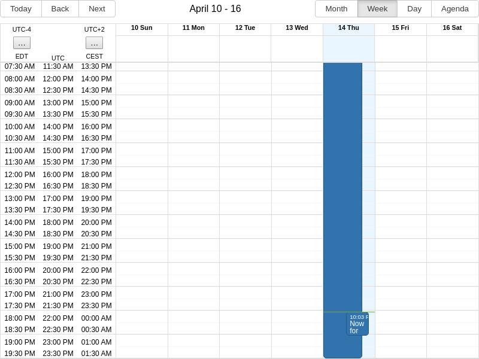

# React Big Calendar Timezone Gutter

[**Online demo**](https://tomashubelbauer.github.io/rbc-timezone-gutter)

In a project I am contributing to, a calendar component is a significant portion
of the core functionality with many flows revolving around it. The application
has a worldwide audience, so naturally, timezone support is an important aspect
of the experience surrounding the use of the calendar.

Since the events the users create are displayed in a shared calendar multiple
users may be reviewing, and since the time-of-day of each item also plays a role
in how various users with different roles will process the calendar events, it
is necessary that users be shown the events in both their local time but also the
local time of the user who originated the event, so that can make judgement on
how to proceed with the item taking into account everyone's schedule, working
hours etc.

Visually, I am envisioning this working by showing two vertical containers in the
week view calendar gutter, as opposed to the existing one. Each entry in the
gutter would show user's local time and the other user's local time and the gutter
header would display IANA time zone names and current offsets (taking into account
DST etc.) of the respective users.

In my case there is no need to support more than two people sharing a single
calendar view so the number of time zone gutters does not have to be dynamic.

I think this could work by overloading some fiels in the calendar's `components`
prop for the week mode. The obvious one to take a look at would be the
`timeGutterHeader` one, but I don't remember what component the gutter cells use.
I know it is the same component as used in the time grid, but you can tell it is
invoked in the context of the time gutter because it's resource value is `null`
or `undefined`, one of the two.

To prototype this, I will install RBC and Moment (for RBC localizer) and its
TypeScript types (Moment bundles its own types).

`npm install --save react-big-calendar moment`,
`npm install --save-dev @types/react-big-calendar`

`timeGutterHeader` worked out nicely, this is exactly the component we need to
override to display two time zone names in the gutter header. The other component
is `timeSlotWrapper` and when `props.resource` is `undefined`, it is the gutter
cell, if it is `null` or a valid value, it is the time grid cell.

- [ ] Contribute correct types for the `timeSlotWrapper` component

We need to style the gutter so that it's two columns side by side, and ideally
we want some flexibility in how we format the time displayed in the gutter (so
that we can e.g. support switching between 12/24 hour clock format), but this is
challenging because RBC's gutter header is not actually sharing a parent container
with the time slot wrappers, so while those can stretch any way they like and the
time grid line will adjust to the width of the widest one, the gutter header cell
will not stretch with the gutter contents.

As a workaround for this (so that we do not have to give both a fixed width and
hope it never goes out of sync of clips the content if format changes), we will
drop the `timeGutterHeader` override and instead display the time zone content
that would have gone to there by special-casing the first time slot wrapper
(the midnight one) so that instead of just two cells it displays four in a 2x2
matrix and shifts the first row (where we will actually place what we want in the
gutter header) up so that it visually ends up being positioned over the gutter.

…actually upon closer inspection, it will be sufficient to use the `rbc-time-header-gutter`
CSS class as the stock time gutter header component does. RBC seems to hook on
whatever element has that class and set its width dynamically to match that of
the gutter width.

---

Now we have a gutter capable of displaying two time stamps for each calendar slot
row as well as two headers which adjust dynamically to match the width of the
gutter so we are free to choose any time stamp format we like in Moment (12/24h).

The next step is to treat the `value` as it comes to the time slot wrapper props
as being in time zone A and tell the calendar what time zone B the gutter should
display the second set of time stamps in. We will reach for `moment-tz` to help
with time zone related concerns.

`npm install --save moment-timezone` & `npm install --save-dev @types/moment-timezone`

Also, similarly to how we preserved the gutter header component class name from
the stock implementation, we are going to do the same with time slot wrapper and
apply `rbc-time-slot` so that it aligns with the time grid lines (it uses flex).

---

With the calculations in place with now have a calendar which shows UTC dates
from the events (actually from the gutter slots) in any configured time zone.

From here on we add a few niceties like a button for switching the time zone of
each gutter and we're done.

[**Online demo**](https://tomashubelbauer.github.io/rbc-timezone-gutter)
